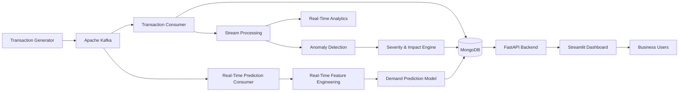

# Real-Time Predictive Analytics & Anomaly Detection Using NoSQL Data

<p align="center">
  <b>End-to-End Real-Time Retail Analytics, Anomaly Detection & Demand Prediction Platform</b>
</p>

<p align="center">
  <a href="http://52.7.190.86:8501"></a>
  <a href="https://github.com/RVRRITHWIK28/realtime-predictive-analytics.git"></a>
</p>

---

## 🚀 Live Access

- **Live Dashboard:** [http://52.7.190.86:8501](http://52.7.190.86:8501)
- **GitHub Repository:** [https://github.com/RVRRITHWIK28/realtime-predictive-analytics.git](https://github.com/RVRRITHWIK28/realtime-predictive-analytics.git)

> Deployed on **AWS EC2** using **Docker Compose**. Features a live Streamlit interface backed by FastAPI, MongoDB, Apache Kafka, event-time stream processing, multi-level anomaly detection, and ML-based demand forecasting.

---

## 📌 Project Overview

**Real-Time Predictive Analytics & Anomaly Detection Using NoSQL Data** is an end-to-end retail analytics platform engineered to ingest high-frequency transaction streams, persist raw records into a NoSQL database, detect business anomalies in real time, forecast item demand, and serve insights through high-performance REST APIs and an interactive operations dashboard.

The architecture emphasizes production-grade patterns:
- Decoupled, asynchronous event ingestion via Kafka
- Document-oriented persistence and secondary indexing via MongoDB
- Event-time window aggregation resilient to out-of-order data arrival
- Real-time rule and ratio anomaly detection enriched with financial impact metrics
- Lag- and calendar-based machine learning inference for demand forecasting
- Microservice orchestration via Docker Compose on AWS EC2

---

## 🎯 Objectives

- Ingest and process high-throughput retail transactions in real time.
- - Implement an event-driven ingestion pipeline with idempotent consumers.
- Maintain a scalable, index-optimized operational data store using MongoDB.
- Compute rolling aggregations (revenue, volume, AOV) over completed event-time windows.
- Detect store- and product-level revenue and quantity anomalies with automated business impact scoring.
- Train, validate, persist, and serve a Random Forest regressor for multi-store SKU-level demand prediction.
- Expose production endpoints with FastAPI and visualize operational metrics via Streamlit.
- Containerize all decoupled components and deploy the complete cluster to AWS EC2.

---

## 🏗️ System Architecture

### High-Level Architecture


---
## 🔄 End-to-End Data FlowPlaintext

```
                 ┌───────────────────────┐
                 │   Transaction Source  │
                 └───────────┬───────────┘
                             │
                             ▼
                    ┌─────────────────┐
                    │  Apache Kafka   │
                    │  transactions   │
                    └───────┬─────────┘
                            │
             ┌──────────────┴──────────────┐
             │                             │
             ▼                             ▼
   ┌──────────────────┐          ┌────────────────────┐
   │ Transaction      │          │ Prediction         │
   │ Consumer         │          │ Consumer           │
   └────────┬─────────┘          └──────────┬─────────┘
            │                               │
            ▼                               ▼
   ┌──────────────────┐          ┌────────────────────┐
   │ MongoDB          │          │ Real-Time Feature  │
   │ Transactions     │          │ Engineering        │
   └────────┬─────────┘          └──────────┬─────────┘
            │                               │
            ▼                               ▼
   ┌──────────────────┐          ┌────────────────────┐
   │ Event-Time       │          │ Demand Prediction  │
   │ Stream Processing│          │ ML Model           │
   └────────┬─────────┘          └──────────┬─────────┘
            │                               │
            ▼                               ▼
   ┌──────────────────┐          ┌────────────────────┐
   │ Analytics &      │          │ MongoDB            │
   │ Anomaly Detection│          │ Predictions        │
   └────────┬─────────┘          └──────────┬─────────┘
            │                               │
            └──────────────┬────────────────┘
                           ▼
                    ┌──────────────┐
                    │   FastAPI    │
                    └──────┬───────┘
                           │
                           ▼
                  ┌─────────────────┐
                  │    Streamlit    │
                  │    Dashboard    │
                  └─────────────────┘
```
---

## ⚙️ Core Components


## 1. Real-Time Data Generation

The project includes a synthetic retail transaction generator capable of producing realistic transaction events.

Each transaction contains:

```
event_id
timestamp
customer_id
product_id
category
store_id
region
quantity
unit_price
discount
payment_method
channel
revenue
```

Revenue is calculated using:

```
Revenue = Quantity × Unit Price × (1 − Discount)
Generated Master Data
20 products
8 stores
1,000 customers
Historical Dataset
```

The historical dataset contains:

```
30 days of transactions
32K+ transactions
Product and store dimensions
Transaction-level revenue
Customer information
Channel and payment information
```

## 2. Apache Kafka — Real-Time Event Streaming

Apache Kafka acts as the real-time event streaming layer.

```

Transaction Producer
        │
        ▼
   Kafka Topic
 "transactions"
        │
        ├───────────────┐
        ▼               ▼
Transaction         Prediction
Consumer             Consumer

```
Kafka is responsible for:

```
Real-time event ingestion
Decoupling producers and consumers
Streaming transaction events
Consumer-group based processing
Event replay
Historical backfill through the same streaming pipeline
```

-The system also handles duplicate transaction events using event_id based idempotency.

## 3. MongoDB — NoSQL Data Storage

MongoDB is used as the primary NoSQL database.

```
Collections
retail_analytics
│
├── transactions
├── anomalies
└── predictions
```

Transactions: Stores incoming retail events.

Anomalies:

Stores detected anomalies with:

```
anomaly type
product/store context
severity
ratios
business impact
recommendations
event/bucket information
Predictions
```

Stores ML demand predictions with:

```
product ID
store ID
prediction date
predicted demand
model version
creation timestamp
```

-Unique indexes and idempotency logic are used to prevent duplicate records.

## 4. Real-Time Stream Processing

The stream processing layer performs event-time based processing.

```
Processing Flow
Kafka Event
     │
     ▼
Event Timestamp
     │
     ▼
Time Bucket
     │
     ▼
Completed Bucket
     │
     ▼
Analytics
     │
     ├── Revenue Metrics
     ├── Quantity Metrics
     ├── Product Metrics
     └── Store Metrics

```

The system supports:

```
Minute-level processing
Event-time bucketing
Out-of-order events
Completed-window processing
Product-level aggregation
Store-level aggregation
Revenue aggregation
Quantity aggregation
Average Order Value calculation
```

-Processing is based on the event timestamp rather than blindly relying on Kafka arrival order.

## 5. Real-Time Anomaly Detection

The platform detects abnormal retail behavior at multiple levels.

```
Anomaly Types
Revenue Anomalies
Revenue spikes
Revenue drops
Quantity Anomalies
Quantity spikes
Quantity drops
Product-Level Anomalies
```

-Detects unusual demand behavior for individual products.

-Store-Level Anomalies

-Detects abnormal transaction behavior at store level.

🚨 Anomaly Processing Pipeline

## 6. Severity & Business Impact

Detected anomalies are enriched with:

```
Severity
Impact ratio
Business impact
Recommendations
```

Example anomaly processing:
```
Anomaly
   │
   ▼
Severity
   │
   ▼
Business Impact
   │
   ▼
Recommendation

```

-This allows the system to move beyond simply saying: "Anomaly detected" and instead provide context useful for business monitoring.

## 7. Machine Learning — Demand Prediction

The predictive component forecasts product demand.

```
ML Pipeline
Historical Transactions
          │
          ▼
Daily Demand Dataset
          │
          ▼
Feature Engineering
          │
          ▼
Time-Based Train/Test Split
          │
          ▼
Baseline Model
          │
          ▼
Random Forest Model
          │
          ▼
Evaluation
          │
          ▼
Model Persistence
          │
          ▼
Real-Time Prediction
```

📊 Training Dataset

The daily demand dataset contains:

```
Product
Store
Date
Demand
Revenue
Calendar information
```

-Final feature dataset: 3,680 rows × 15 features

🧠 Feature Engineering

The model uses:
```
Historical Demand Features
lag_1
lag_2
lag_7
rolling_mean_7
Calendar Features
```

Examples include:

```
Day of week
Day
Month
Weekend indicators
Other date-derived features
Categorical Features
Product
Store
Category
Region
```

⏱️ Time-Based Model Validation

Instead of randomly splitting the data, the project uses a chronological split.

```
Historical Data
────────────────────────────────────────────>

Training Period              Testing Period
Sep 8 ───────── Sep 23       Sep 24 ───── Sep 30
```

-This better represents a real forecasting scenario where historical data is used to predict future observations.

 🤖 Model

-The primary demand prediction model is: Random Forest Regressor

-The project also includes a simple lag-based baseline for comparison.

Baseline
```
MAE  : 9.56
RMSE : 12.74
MAPE : 74.55%
Random Forest
MAE  : 7.41
RMSE : 9.89
MAPE : 57.95%
```

The model is persisted using:

```
models/
├── demand_model.joblib
└── demand_model_metadata.json
```

-The reported metrics are based on the project's current synthetic dataset and evaluation split.


🔮 Real-Time ML Prediction

The trained model is integrated into the streaming system.


```
Live Transactions
       │
       ▼
Daily Demand Aggregation
       │
       ▼
Real-Time Feature Engineering
       │
       ├── lag_1
       ├── lag_2
       ├── lag_7
       └── rolling_mean_7
       │
       ▼
Saved ML Model
       │
       ▼
Predicted Demand
       │
       ▼
MongoDB
       │
       ▼
FastAPI
       │
       ▼
Dashboard
```
-Predictions are generated only when the relevant event-time period has completed.

## 8. FastAPI Backend

-FastAPI provides the REST API layer between MongoDB and the dashboard.

API Architecture
```
Streamlit
    │
    ▼
 FastAPI
    │
    ├── Analytics
    ├── Predictions
    ├── Anomalies
    ├── Products
    ├── Stores
    └── Health
    │
    ▼
 MongoDB

```

API Capabilities
Health:
GET /health
GET /health/detailed
Analytics

Provides aggregated retail metrics.

Predictions:
GET /predictions/

Supports prediction retrieval and filtering.

Anomalies:
GET /anomalies/

Provides detected anomaly information.

Products:
GET /products/

Provides product-level information.

Stores:
GET /stores/

Provides store-level information.

The API includes:
```
Filtering
Sorting
Result limits
Error handling
MongoDB health checks
404 handling
Database connection cleanup
```

## 9. Streamlit Dashboard

The professional Streamlit dashboard provides a real-time monitoring interface.

```
Dashboard Features
KPI Monitoring
Transactions
Units sold
Revenue
Average Order Value
Products
Stores
Analytics
Revenue analysis
Transaction analysis
Quantity analysis
Product analytics
Store analytics
Anomaly Monitoring
Detected anomaly count
Anomaly details
Severity
Product/store context
Business impact
Prediction Monitoring
Predicted demand
Product
Store
Prediction date
Model version
Prediction Explorer
```

Allows users to inspect prediction results by product and store.

Real-Time Refresh

The dashboard automatically refreshes approximately every 5 seconds.

## 🐳 10. Docker Architecture

The entire application is containerized using Docker Compose.


Services

```
docker-compose.yml
│
├── kafka
├── mongodb
├── api
├── transaction-producer
├── transaction-consumer
├── prediction-consumer
└── dashboard
```


Service Responsibilities

```
Service	Responsibility
Kafka	Event streaming
MongoDB	NoSQL persistence
API	REST services
Transaction Producer	Generates live events
Transaction Consumer	Persists transactions
Prediction Consumer	Runs real-time prediction pipeline
Dashboard	Visualization
```

## ☁️ 11. AWS Deployment

The application is deployed on: AWS EC2


Infrastructure
```
AWS
│
└── EC2
    │
    └── Docker Compose
        │
        ├── Kafka
        ├── MongoDB
        ├── FastAPI
        ├── Transaction Producer
        ├── Transaction Consumer
        ├── Prediction Consumer
        └── Streamlit
```

Deployment Components

```
Amazon EC2
Amazon Linux 2023
Docker
Docker Compose
AWS Systems Manager Session Manager
Elastic IP
Security Groups
Current Live Endpoint
http://52.7.190.86:8501
```

---

🔐 Security & Configuration

Environment-specific configuration is maintained using .env.

Example configuration:

-PROJECT_NAME=Real-Time Predictive Analytics & Anomaly Detection
-VERSION=1.0.0
-ENVIRONMENT=production

-KAFKA_BOOTSTRAP_SERVERS=kafka:29092
-TRANSACTION_TOPIC=transactions
-CONSUMER_GROUP=analytics-group

-MONGODB_URI=mongodb://mongodb:27017
-DATABASE_NAME=retail_analytics

-TRANSACTIONS_COLLECTION=transactions
-ANOMALIES_COLLECTION=anomalies
-PREDICTIONS_COLLECTION=predictions

Sensitive environment files are excluded from Git using .gitignore.

🧪 Testing & Validation

The project includes testing across multiple layers.

Data Validation

Verified:

```
Schema validity
Missing values
Duplicate event IDs
Revenue consistency
Dataset integrity
Kafka Validation
```

Verified:

```
Producer → Kafka
Kafka → Consumer
Historical replay
Duplicate event handling
Stream Processing Validation
```

Verified:

```
Event-time processing
Out-of-order events
Completed time buckets
Aggregation correctness
Anomaly Validation
```

Verified:

```
Revenue anomalies
Quantity anomalies
Product anomalies
Store anomalies
Persistence
Idempotency
ML Validation
```

Verified:

```
Training dataset creation
Feature engineering
Time-based splitting
Baseline model
Random Forest model
Model persistence
Model reload
Real-time prediction
API Validation
```

-The FastAPI test suite successfully passed:

10 tests passed
Production Validation

The deployed AWS environment was verified end-to-end:
```
Transaction Producer
        ↓
Kafka
        ↓
Transaction Consumer
        ↓
MongoDB
        ↓
Analytics / ML
        ↓
Prediction Consumer
        ↓
MongoDB
        ↓
FastAPI
        ↓
Streamlit
```

---

📈 Current System Scale

The current synthetic environment includes:

```
Metric	Value
Products	20
Stores	8
Customers	1,000
Historical transactions	32K+
Feature rows	3,680
Kafka topic	transactions
MongoDB collections	3
ML model	Random Forest
Dashboard refresh	~5 seconds
```

---

## 🗂️ Project Structure
```
realtime-predictive-analytics/
│
├── data/
│   ├── raw/
│   └── processed/
│
├── models/
│   ├── demand_model.joblib
│   └── demand_model_metadata.json
│
├── src/
│   │
│   ├── api/
│   │   ├── main.py
│   │   ├── predictions.py
│   │   ├── anomalies.py
│   │   ├── analytics.py
│   │   ├── products.py
│   │   └── stores.py
│   │
│   ├── config/
│   │   ├── settings.py
│   │   └── logging_config.py
│   │
│   ├── dashboard/
│   │   ├── app.py
│   │   └── app_professional.py
│   │
│   ├── ingestion/
│   │   ├── schemas.py
│   │   ├── master_data.py
│   │   ├── data_generator.py
│   │   ├── historical_generator.py
│   │   ├── generate_dataset.py
│   │   ├── anomaly_injector.py
│   │   └── generate_anomalous_dataset.py
│   │
│   ├── streaming/
│   │   ├── kafka_config.py
│   │   ├── producer.py
│   │   ├── consumer.py
│   │   ├── transaction_producer.py
│   │   ├── transaction_consumer.py
│   │   ├── transaction_mongo_consumer.py
│   │   ├── realtime_prediction_consumer.py
│   │   └── historical_producer.py
│   │
│   ├── database/
│   │   ├── mongodb.py
│   │   ├── anomaly_repository.py
│   │   ├── prediction_repository.py
│   │   └── transaction repositories/utilities
│   │
│   ├── processing/
│   │   ├── stream_processor.py
│   │   ├── time_bucket.py
│   │   ├── completed_bucket.py
│   │   ├── bucket_analytics.py
│   │   ├── unified_anomaly_pipeline.py
│   │   ├── anomaly_persistence_pipeline.py
│   │   ├── daily_demand_tracker.py
│   │   └── streaming_prediction_pipeline.py
│   │
│   └── ml/
│       ├── anomaly_detector.py
│       ├── bucket_anomaly_detector.py
│       ├── revenue_anomaly_detector.py
│       ├── quantity_anomaly_detector.py
│       ├── product_anomaly_detector.py
│       ├── store_anomaly_detector.py
│       ├── anomaly_severity.py
│       ├── business_impact.py
│       ├── anomaly_event.py
│       ├── create_training_dataset.py
│       ├── feature_engineering.py
│       ├── train_test_split.py
│       ├── baseline_model.py
│       ├── train_demand_model.py
│       ├── evaluate_demand_model.py
│       ├── save_demand_model.py
│       ├── prediction_service.py
│       ├── realtime_features.py
│       ├── realtime_prediction.py
│       └── realtime_predict_and_store.py
│
├── tests/
│
├── notebooks/
│
├── logs/
│
├── Dockerfile
├── docker-compose.yml
├── requirements.txt
├── .dockerignore
├── .gitignore
└── README.md
```


## 🛠️ Technology Stack

```
Data Engineering
Python
Apache Kafka
MongoDB
Pandas
Event-time stream processing
Machine Learning
Scikit-learn
Random Forest
Feature Engineering
Time-Series / Lag Features
Demand Forecasting
Anomaly Detection
Backend
FastAPI
Uvicorn
REST APIs
Visualization
Streamlit
Matplotlib
DevOps / Deployment
Docker
Docker Compose
AWS EC2
AWS Systems Manager
Linux
Development Tools
Git
GitHub
Python Virtual Environment
```

## 🚀 Running the Project Locally
---

-1. Clone the repository
git clone https://github.com/RVRRITHWIK28/realtime-predictive-analytics.git

cd realtime-predictive-analytics


-2. Create a virtual environment


Windows

python -m venv venv


.\venv\Scripts\activate

Linux / macOS

python3 -m venv venv

source venv/bin/activate

-3. Install dependencies
pip install -r requirements.txt


-4. Configure environment variables

Create a .env file:

PROJECT_NAME=Real-Time Predictive Analytics & Anomaly Detection

VERSION=1.0.0

ENVIRONMENT=development


KAFKA_BOOTSTRAP_SERVERS=localhost:9092

TRANSACTION_TOPIC=transactions

CONSUMER_GROUP=analytics-group


MONGODB_URI=mongodb://localhost:27017

DATABASE_NAME=retail_analytics


TRANSACTIONS_COLLECTION=transactions

ANOMALIES_COLLECTION=anomalies

PREDICTIONS_COLLECTION=predictions

---

## 🐳 Running with Docker Compose

Start the complete infrastructure: docker compose up -d

Check services: docker compose ps

View logs: docker compose logs -f

Stop the stack: docker compose down

---

## 🌐 Accessing the Application

Streamlit Dashboard: http://localhost:8501

FastAPI: http://localhost:8000

FastAPI Health: http://localhost:8000/health

FastAPI Detailed Health: http://localhost:8000/health/detailed

Interactive API Documentation: http://localhost:8000/docs


📊 Example End-to-End Scenario

A new transaction enters the system:
```
Customer purchases Product P1004
            │
            ▼
Transaction Producer
            │
            ▼
Kafka
            │
            ▼
Transaction Consumer
            │
            ├──────────────► MongoDB
            │
            ▼
Event-Time Processing
            │
            ▼
Analytics
            │
            ├──────────────► Anomaly Detection
            │                       │
            │                       ▼
            │                  MongoDB
            │
            ▼
Demand Aggregation
            │
            ▼
ML Feature Engineering
            │
            ▼
Random Forest
            │
            ▼
Demand Prediction
            │
            ▼
MongoDB
            │
            ▼
FastAPI
            │
            ▼
Streamlit Dashboard
```
---
## 💡 Key Engineering Concepts Demonstrated

This project demonstrates practical implementation of:

```
Event-driven architecture
Real-time data ingestion
Apache Kafka
Kafka consumer groups
NoSQL database design
MongoDB indexing
Idempotent event processing
Event-time processing
Out-of-order event handling
Windowed analytics
Real-time anomaly detection
Machine learning pipelines
Time-series feature engineering
Demand forecasting
REST API development
Dashboard development
Containerization
Docker Compose
Cloud deployment
Production configuration
Health checks
Logging
End-to-end system integration
```

---
## 🔍 Production-Oriented Design

The project incorporates several production-oriented practices:

Idempotency: Duplicate transaction events are prevented using unique event identifiers.

Event-Time Processing: Events are grouped based on their timestamps rather than simply their arrival order.

Completed Window Processing: Analytics and prediction logic waits for relevant time periods to complete.

Health Monitoring: Docker health checks and FastAPI health endpoints are implemented.

Environment Configuration: Environment-specific values are separated using .env.

Logging: Application activity is written to application logs and console output.

Containerization: The application and supporting infrastructure are deployed as independent Docker services.

---

## 📌 Future Improvements

Potential future improvements include:

```
HTTPS with a custom domain
CI/CD pipeline
Cloud-native managed Kafka
Managed MongoDB
Distributed stream processing
Model monitoring
Automated model retraining
Data drift detection
Advanced forecasting models
Role-based API authentication
Centralized observability
Infrastructure as Code
```

These are future enhancements and are not currently required for the core system.

---

## 👨‍💻 Author

Rithwik Ramadugu

B.Tech — Computer Science Engineering,
VIT Vellore

Areas of Interest - 
Data Engineering,
Machine Learning,
Real-Time Analytics,
Generative AI,
Cloud Computing.

## ⭐ Project Highlights

```
✔ Real-Time Kafka Data Pipeline
✔ MongoDB NoSQL Storage
✔ Event-Time Stream Processing
✔ Multi-Level Anomaly Detection
✔ Business Impact Analysis
✔ ML-Based Demand Forecasting
✔ Real-Time Prediction Pipeline
✔ FastAPI REST Backend
✔ Interactive Streamlit Dashboard
✔ Dockerized Microservice Architecture
✔ AWS EC2 Deployment
✔ Public Live Dashboard
```
---
## 🔗 Project Links

🌐 Live Demo: http://52.7.190.86:8501

💻 GitHub: https://github.com/RVRRITHWIK28/realtime-predictive-analytics.git
